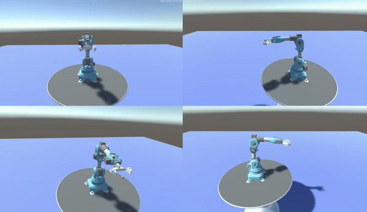

# RL-FloatGrasp: Reinforcement Learning for Grasping in 3D Space

Welcome to the RL-FloatGrasp repository. This repository houses the official implementation of the algorithms presented in the research paper titled "Reinforcement Learning Technique for Grasping Random Floating Object in 3D Space with 6DOF Robotic Arm" authored by K. Nguyen. Our research explores cutting-edge reinforcement learning strategies to control a six-degree-of-freedom (6DOF) robotic arm for grasping objects in motion within a three-dimensional environment.

## Demonstration

The effectiveness of our approach is demonstrated in the Unity simulation environment. The animation below visualizes the robotic arm successfully employing the proposed reinforcement learning strategy to grasp a target object.

<div align="center">
    
</div>

A detailed system diagram of the reinforcement learning approach is provided for reference:

<div align="center">
    
</div>

For comprehensive details, visit our project webpage: [RL-FloatGrasp Project](https://rl-floatgrasp.github.io/)

## Getting Started

### Prerequisites

Ensure Docker is installed and configured on your system. If you need to install Docker, please follow the official guide: [Install Docker](https://docs.docker.com/get-docker/).

### Installation

#### Building the ROS MoveIt Motion Planning Environment in Docker

To create the Docker environment necessary for running the motion planning with ROS MoveIt, execute the following command in your terminal:

```bash
sudo docker build --no-cache -t unity-robotics:pick-and-place -f docker/Dockerfile .
```

## Usage

### Training

To initiate the training sequence, first run the Docker container with the following command:

```bash
sudo docker run -it --rm -p 10000:10000 unity-robotics:pick-and-place /bin/bash
```

Once inside the Docker environment, start the `point_to_point` ROS node from the `niryo_moveit` package:

```bash
roslaunch niryo_moveit point_to_point.launch
```

Begin the training process by executing:

```bash
python train.py --nsubsteps 15 \
                --max-timesteps 25 \
                --n-episodes 10 \
                --n-epochs 40 \
                --reward-type dense \
                --batch-size 1024 \
                --n-test-rollouts 10 \
                --polyak 0.9 \
                --file-name ./simulation/build/train/UnderwaterArm 
```

### Testing

To run the testing sequence, use the following command:

```bash
python test.py  --nsubsteps 15 \
                --max-timesteps 50 \
                --reward-type dense \
                --file-name ./simulation/build/UnderwaterArm \
                --load-dir RefinedUnderwaterEnv/model_default_2023-08-26-21-19-33.pt 
```

## Contact

Should you have any questions or require further clarification, please do not hesitate to reach out to the primary researcher, K. Nguyen.

We appreciate your interest in RL-FloatGrasp and look forward to any contributions or feedback.
